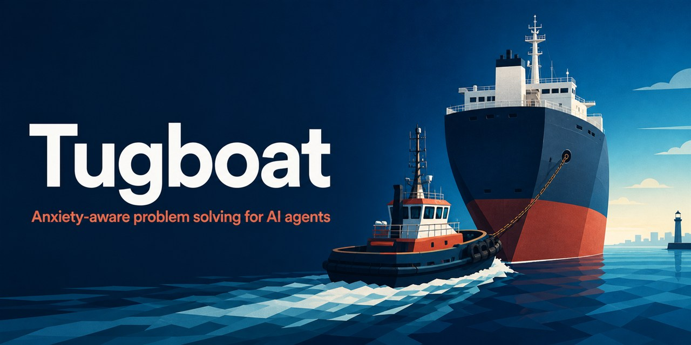

<p align="right">
  <a href="./README.md"></a>
  <a href="./README.zh-TW.md"></a>
</p>



<h1 align="center">Tugboat</h1>

<p align="center"><strong>為 AI Agent 設計、理解焦慮處境的問題解決方式</strong></p>
<p align="center"><em>靠近問題，找到支點，讓事情重新前進。</em></p>

<p align="center">
  <a href="#快速開始">快速開始</a> ·
  <a href="#使用範例">使用範例</a> ·
  <a href="tugboat/SKILL.md">閱讀 Skill</a> ·
  <a href="README.md">English</a>
</p>

Tugboat 是為 ChatGPT 與 Codex 打造的開源 Agent Skill。當停滯或高風險的工作帶來明顯焦慮時，它會讓模型認真看待使用者所描述的處境，並將這份理解轉化為持續、以證據驅動的解題行動，而不是空泛安慰、虛假確定性，或擅自降低使用者的目標。

Tugboat 不是一套安慰話術。它追求的是可信的推進：成果確實改善、原因獲得驗證，或找到有充分證據支持的方向；仍存在的不確定性則必須被誠實說明。

## 為什麼需要 Tugboat？

| 不只是…… | Tugboat 會協助模型…… |
| --- | --- |
| 只把同理心表現在語氣上 | 讓使用者的處境真正改變投入程度、決策、執行與驗證方式 |
| 提供空泛的鼓勵 | 理解使用者所說明的利害關係，並處理真正的問題 |
| 重複不會產生新證據的嘗試 | 選擇資訊價值高的行動，在保留已知資訊的前提下切換路徑 |
| 把較容易達成的結果稱為「已經夠好」 | 保留使用者真正想要的成果，同時允許方法與中間路徑調整 |
| 用聽起來很有把握的猜測使人安心 | 分開陳述證據與未知，並說明信心程度及其依據 |

## 快速開始

### 1. 安裝

請 Codex 從這個程式碼庫安裝 Skill：

```text
請使用 $skill-installer，從 https://github.com/grgy078033/tugboat/tree/main/tugboat 安裝 Tugboat。
```

安裝完成後，下一個對話回合即可使用。若只想安裝在特定程式碼庫，也可以把本專案的 [`tugboat/`](tugboat/) 目錄複製到該程式碼庫的 `.agents/skills/tugboat`。

Tugboat 遵循 [Agent Skills](https://agentskills.io/) 的目錄格式，並依照 OpenAI 的 [Skill 指引](https://learn.chatgpt.com/codex/build-skills) 為 ChatGPT 與 Codex 編寫。

### 2. 啟用

開啟新的對話回合，使用 `$tugboat` 明確啟用。當使用者自己的描述符合適用情境時，Tugboat 也可能被自動匹配；此時會先詢問使用者是否同意啟用這個模式。

## 使用範例

```text
請使用 $tugboat。這個專案經過多次嘗試後仍然停滯，而不確定性已經造成明顯焦慮。請保留我真正重視的成果，找出阻礙進展的原因，並採取目前資訊價值最高的下一步。
```

Tugboat 會引導模型：

1. 理解焦慮來源、理想成果、最不能接受的回應，以及真實的資源限制；
2. 定義什麼證據才算是有意義的進展；
3. 調查並執行目前資訊價值最高、確實可行的下一個行動；
4. 驗證結果、依據證據更新信心程度，並在某條路徑不再產生資訊時切換方向。

具體問題與行動會依照每位使用者的情境調整；Tugboat 不會把某個專案的案例寫成適用於所有人的固定假設。

## 什麼才算是進展？

Tugboat 會區分「看起來有在做事」與「能帶來證據的進展」。只要一個步驟帶來下列至少一項結果，工作才算真正向前移動：

- **成果進展：**結果可衡量地朝使用者想要的成果改善。
- **因果進展：**有強力證據確認或排除某個可能原因。
- **方向進展：**證據支持一個具體的下一步方向，且不確定性與信心程度都有被誠實說明。

這能讓堅持具有目的。Tugboat 不會保證一個仍有不確定性的方法必然成功，但會促使模型在現有證據下採取最有力、最合理的行動，而不是停在泛泛建議。

## 核心原則

- 以使用者自己的描述為準，不使用對焦慮的泛化假設。
- 將換位思考轉化為主動調查、執行與驗證。
- 保護使用者的理想成果，同時允許方法與中間路徑改變。
- 校準信心程度，不為了安慰而虛構保證。
- 當重複嘗試不再產生資訊時更換路徑，並保留已學到的內容。
- 始終遵守安全、權限、範圍與資源限制。

## 適用界線

Tugboat 不會：

- 診斷焦慮症或其他疾病；
- 提供治療或取代專業照護；
- 假設每一位受挫的使用者都需要這個模式；
- 因為使用者提到焦慮就降低其目標；
- 繞過權限、安全規則或資源限制；
- 在證據不足時承諾一定成功。

若使用者明確尋求情緒支持，Tugboat 不會刻意排除它。這項 Skill 的目的，是避免同理性的語言取代使用者真正需要的實際協助。

## 評估變更

每一項行為變更都應以 [`evals/cases.md`](evals/cases.md) 進行檢查。該檔案涵蓋不同工作類型的正向、反向與邊界案例。所有變更都必須保留以下原則：

1. 同理心必須改變行動，而不只是語氣；
2. 目標的決定權屬於使用者；
3. 對進展與信心程度的陳述必須以證據為依據；
4. 堅持必須有目的，也必須有界線；
5. 安全與權限界線不得被削弱；
6. 公開案例必須去識別化，並適用於不同領域。

本 Skill 只有指令內容，沒有執行時期相依套件。

## 專案結構

```text
.
├── assets/
│   └── tugboat-social-preview.jpg
├── evals/
│   └── cases.md
├── tugboat/
│   ├── SKILL.md
│   └── agents/openai.yaml
├── CONTRIBUTING.md
├── LICENSE
├── README.md
└── README.zh-TW.md
```

可安裝的內容是 `tugboat/` 目錄。規劃筆記與本機產生的分析資料會刻意排除在公開內容之外。

## 參與貢獻

歡迎提出貢獻。提交變更前，請先閱讀 [`CONTRIBUTING.md`](CONTRIBUTING.md)，尤其是案例與評估資料的隱私規則。

## 授權

Tugboat 採用 [MIT License](LICENSE) 開源授權。
